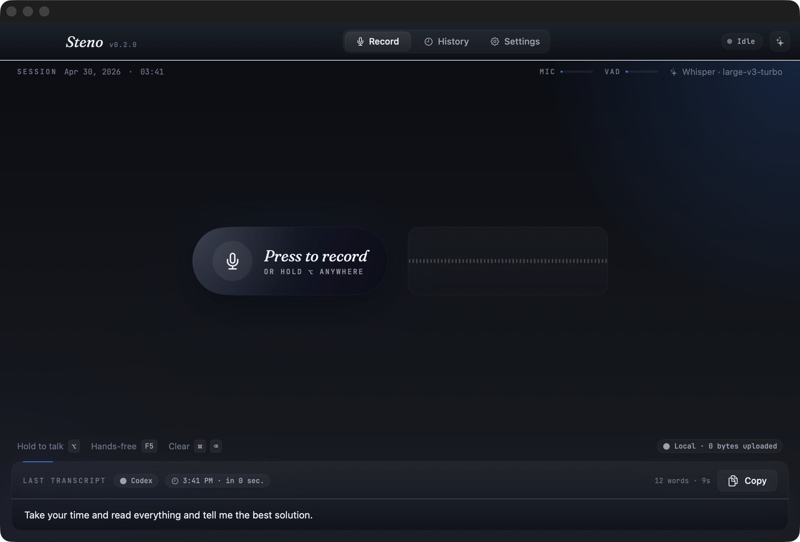
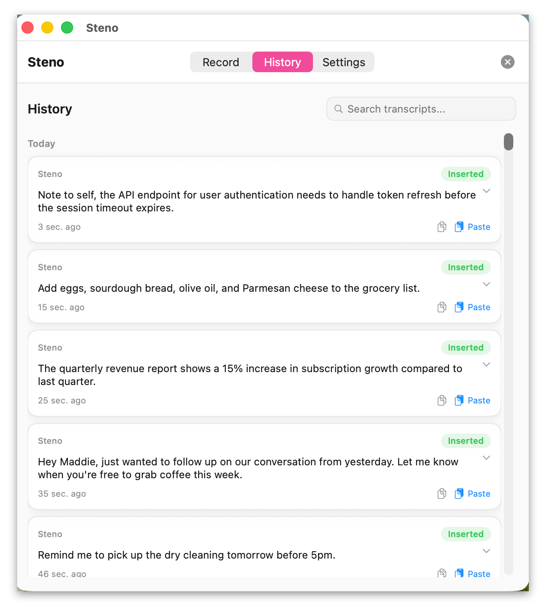
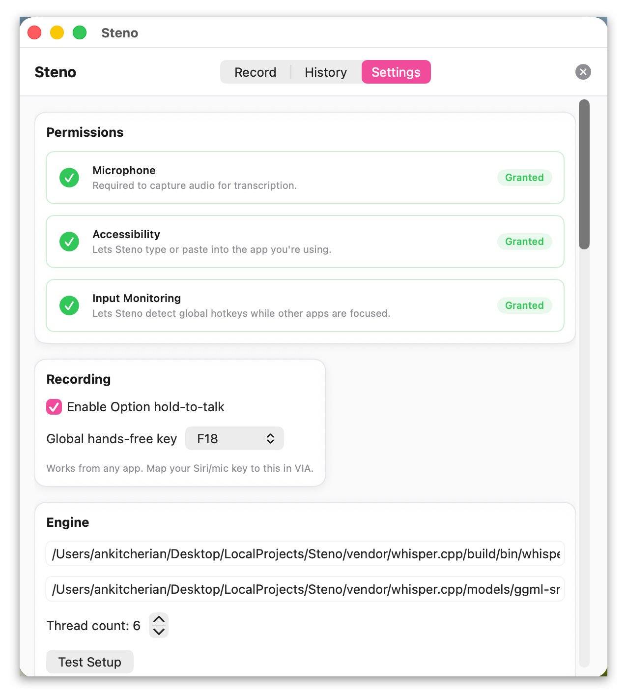
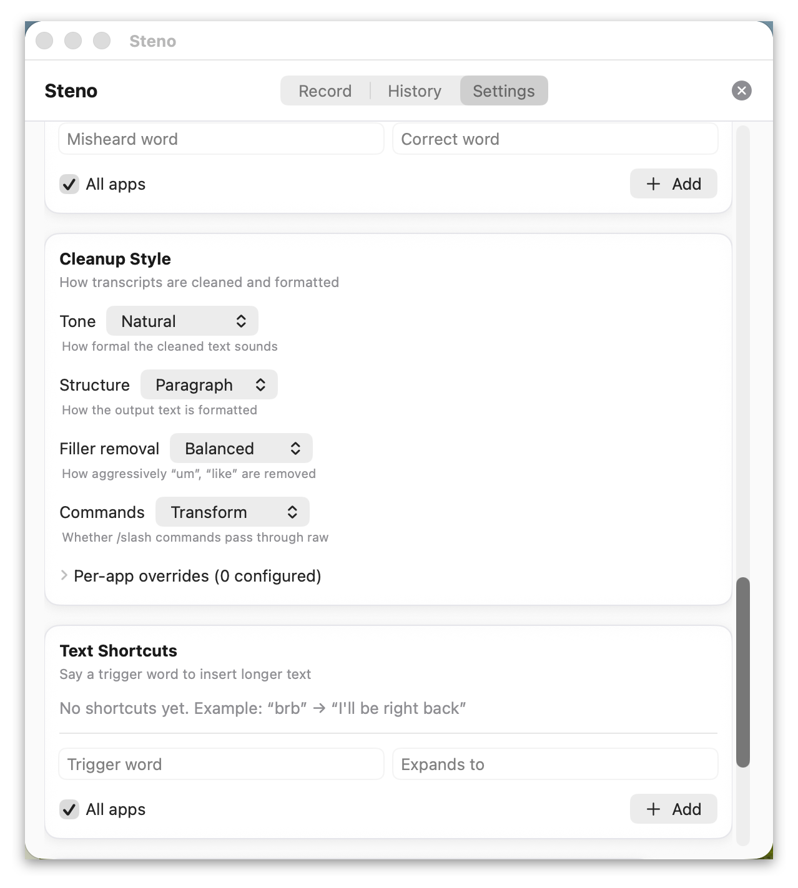

# Steno

Fast macOS voice-to-text with smart app-aware insertion and optional text cleanup.

Steno is built for a premium dictation workflow without subscription lock-in: high-accuracy local transcription with `whisper.cpp`, fast hotkeys, and reliable text output across apps.

[](https://github.com/Ankit-Cherian/steno/actions/workflows/swift-tests.yml)

## Choose Your Path

- **I want to use Steno**: follow [QUICKSTART.md](QUICKSTART.md) or the quick setup below.
- **I want to contribute**: start with [CONTRIBUTING.md](CONTRIBUTING.md) and the architecture notes below.

## What Steno Does

- High-accuracy local transcription with `whisper.cpp` (audio never leaves your Mac)
- Smart app-aware paste (target-aware insertion): terminals prefer paste, editors use direct typing or accessibility insertion
- Optional cloud text cleanup with OpenAI (text-only, budget-guarded)
- Global hotkeys: Option hold-to-talk and configurable hands-free toggle
- Menu bar app with status overlay
- 30-day transcript history with search
- Personal lexicon, style profiles, and snippets
- VoiceOver accessibility support

## Screenshots

<table>
  <tr>
    <td></td>
    <td></td>
  </tr>
  <tr>
    <td></td>
    <td></td>
  </tr>
</table>

## Requirements

- macOS 13.0+
- Xcode 26+ (Swift 6.2+)
- XcodeGen (`brew install xcodegen`)
- whisper.cpp built locally
- CMake (`brew install cmake`)

## Quick Setup

1. Clone the repository:
   ```bash
   git clone https://github.com/Ankit-Cherian/steno.git
   cd steno
   ```

2. Build whisper.cpp:
   ```bash
   git clone https://github.com/ggerganov/whisper.cpp vendor/whisper.cpp
   cd vendor/whisper.cpp
   git checkout v1.8.3
   cmake -B build && cmake --build build --config Release
   cd ../..
   ```

3. Download a transcription model:
   ```bash
   cd vendor/whisper.cpp
   ./models/download-ggml-model.sh small.en
   cd ../..
   ```

4. Generate the local Xcode project (generated from `project.yml`, not tracked in git):
   ```bash
   xcodegen generate
   ```

5. Open your local `Steno.xcodeproj` in Xcode and set your Apple Developer Team in Signing & Capabilities.

6. Build and run (Cmd+R).

7. Grant required permissions when prompted:
   - Microphone: record your voice
   - Accessibility: let Steno type or paste into the active app
   - Input Monitoring: let Steno detect global hotkeys

## Usage

- **Option Hold-to-Talk**: hold Option to record, release to transcribe and insert
- **Hands-Free Toggle**: press the configured function key (default `F18`) to start/stop recording
- **Menu Bar**: Click icon to show app window, right-click for quick actions
- **Recording Modes**: Press-to-talk (immediate recording) or hands-free (toggle on/off)
- **Text Output**: app-aware routing picks the safest insertion method for your current app

## Verify Setup

- Hold `Option` to record and release to transcribe.
- Use the hands-free toggle key (default `F18`).
- Confirm insertion works in both a text editor and a terminal.

## Architecture (Contributor View)

Steno uses a two-layer design:

- **`StenoKit/`**: pure Swift package with business logic, protocols, models, and services (no UI)
- **`Steno/`**: SwiftUI app target with views, `DictationController` orchestration, and settings persistence

Key patterns: protocol-first dependency injection, actor isolation, no singletons, `Sendable` value types.

## Testing (Contributor View)

Run the core package tests from the repository root:

```bash
cd StenoKit
CLANG_MODULE_CACHE_PATH=/tmp/steno-clang-cache \
SWIFT_MODULECACHE_PATH=/tmp/steno-swift-cache \
swift test
```

Run a single test by function name:

```bash
cd StenoKit
CLANG_MODULE_CACHE_PATH=/tmp/steno-clang-cache \
SWIFT_MODULECACHE_PATH=/tmp/steno-swift-cache \
swift test --filter budgetGuardDegradedMode
```

## Known Limitations

- macOS only (no Windows/Linux desktop target yet)
- Setup currently expects local whisper.cpp build and model download
- Full end-to-end behavior depends on user-granted macOS permissions
- Cloud cleanup is optional and requires your own API key

## Contributing

See [CONTRIBUTING.md](CONTRIBUTING.md) for development setup, code style guidelines, and PR process.

## Security

See [SECURITY.md](SECURITY.md) for vulnerability reporting and response expectations.

## Support

See [SUPPORT.md](SUPPORT.md) for usage help and bug report paths.

## License

MIT — see [LICENSE](LICENSE) file for details.
