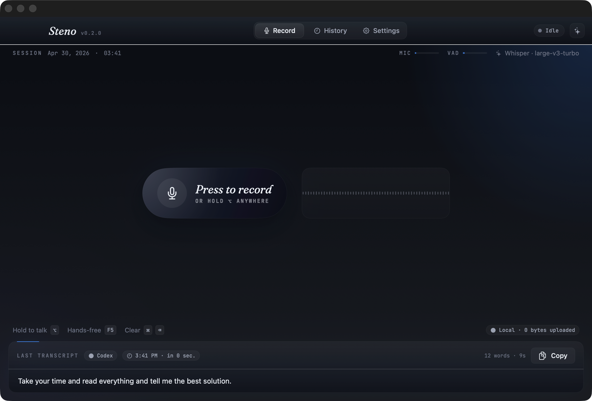
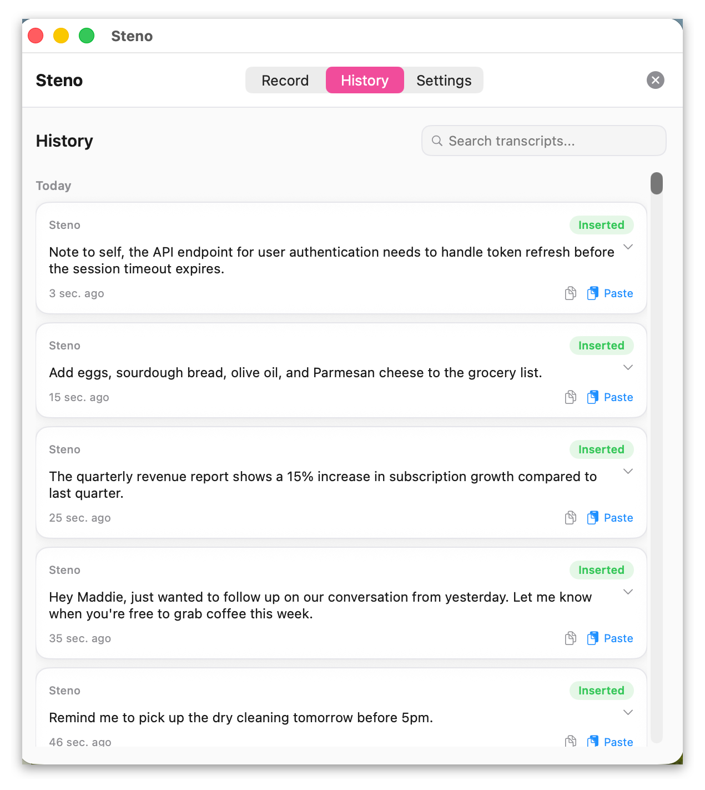
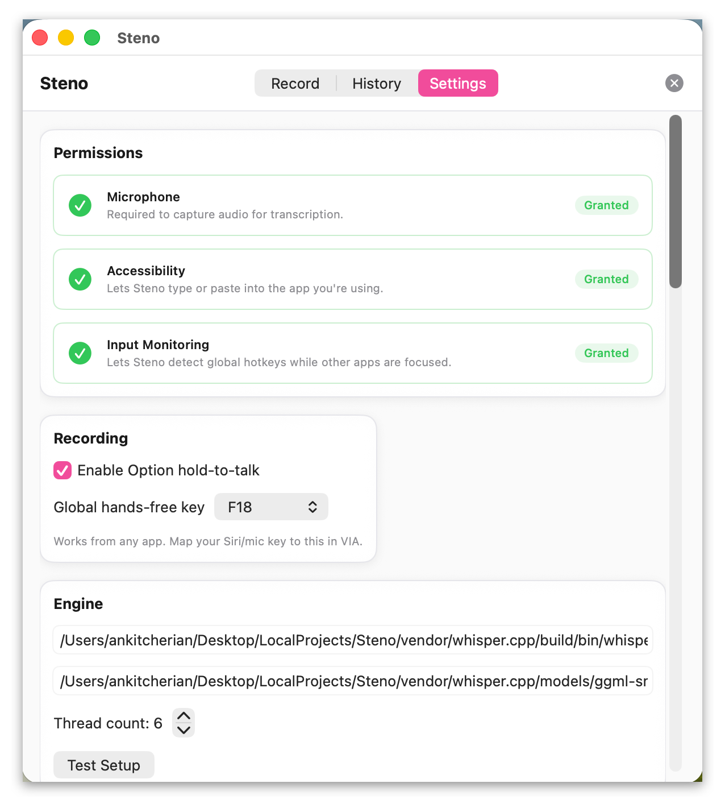
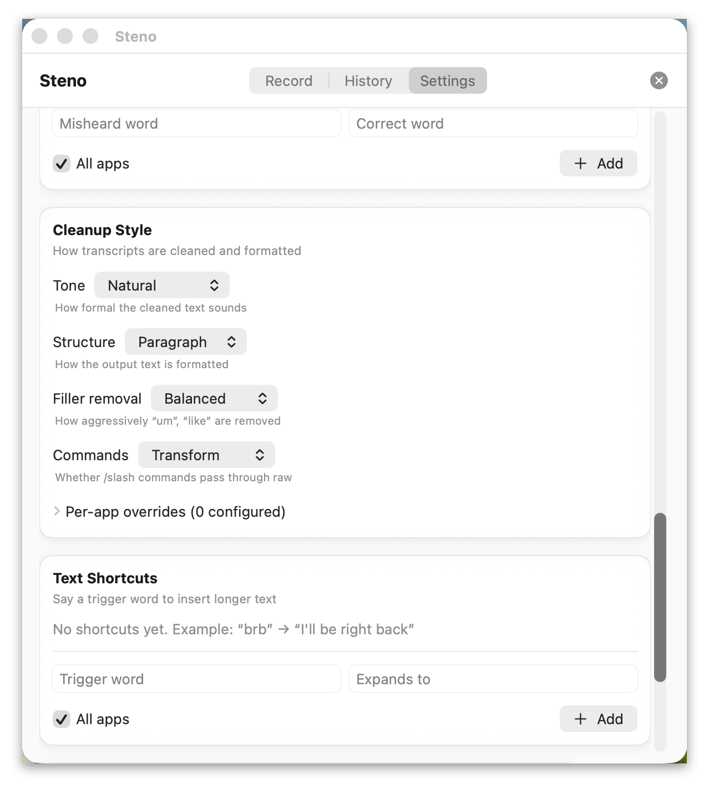

# Steno

Fast local dictation for macOS, redesigned for 0.2.

Steno is a local-first voice-to-text app for people who want fast dictation, reliable insertion, and smart cleanup without shipping their audio to a hosted transcription service. Version 0.2 is the first release that fully combines the redesigned macOS product surface with the recent engine, cleanup, and release-eval work.

[](https://github.com/Ankit-Cherian/steno/actions/workflows/swift-tests.yml)

## Why 0.2 Matters

- Full macOS redesign across the app shell, Record, History, Settings, onboarding, and the floating overlay.
- Richer local transcription pipeline with JSON-aware `whisper.cpp` ingestion, hot-term steering, and better hardware/model guidance.
- Stronger cleanup behavior for repairs, filler removal, prompt contamination, and no-speech handling without adding a cloud cleanup dependency.
- Formal smoke and release-eval workflows, plus an exact validated hardware/model row for the current canonical signoff run.

## What Steno Does

- High-accuracy local transcription with `whisper.cpp`
- Bundled `small.en` for immediate first-run use, with in-app downloads for larger canonical models based on your hardware
- App-aware insertion: direct typing where it is safe, clipboard-first behavior where terminals or LLM surfaces need it
- Global dictation controls: `Option` hold-to-talk plus a configurable hands-free toggle key
- Local cleanup with tone, structure, filler, and command-passthrough policies
- Personal lexicon corrections, app-specific overrides, and text shortcuts
- Searchable transcript history with recovery-oriented copy and paste actions
- VoiceOver-aware controls and reduced-motion-aware animation behavior
- Floating recording overlay with waveform motion, terminal-state icons, and compact cancel controls

## Validated Release Evidence

The current 0.2 candidate has a fresh canonical release-eval bundle rooted at:

`research/benchmarks/generated/release-signoff-2026-04-23-macbook-pro-m5-pro-64gb-large-v3-turbo`

Exact measured facts from that bundle:

- Validated row: `m5-pro / 64GB / large-v3-turbo`
- Canonical release-eval result: `pass`
- Raw WER -> cleaned WER: `0.2236842105 -> 0.0921052632`
- Raw CER -> cleaned CER: `0.2335423197 -> 0.0877742947`
- Coordinator latency: `p50 1049 ms`, `p90 1060 ms`, `p99 1114 ms`
- Not evaluable gate: `commandPassthroughAccuracy`
- Manual Mac sanity: `pending`

Important boundaries:

- This validates the exact row above, not every Pro or Max configuration.
- Smoke fixtures are preflight checks, not release evidence.
- Manual macOS sanity is still tracked separately from the blocking metric gate.
- Command passthrough is still conservative in public claims because the canonical corpus does not yet preserve a raw leading slash through the raw benchmark pass.

## Screenshots

Representative 0.2 redesign screenshots:

<table>
  <tr>
    <td></td>
    <td></td>
  </tr>
  <tr>
    <td></td>
    <td></td>
  </tr>
</table>

## Quick Setup

If you want the fastest path to a local run, use [QUICKSTART.md](QUICKSTART.md). The short version:

1. Clone the repository:

   ```bash
   git clone https://github.com/Ankit-Cherian/steno.git
   cd steno
   ```

2. Build `whisper.cpp` locally:

   ```bash
   git clone https://github.com/ggerganov/whisper.cpp vendor/whisper.cpp
   cd vendor/whisper.cpp
   git checkout v1.8.3
   cmake -B build && cmake --build build --config Release
   cd ../..
   ```

3. Download at least one canonical model, plus the VAD model:

   ```bash
   cd vendor/whisper.cpp
   ./models/download-ggml-model.sh small.en
   ./models/download-ggml-model.sh medium.en
   ./models/download-ggml-model.sh large-v3-turbo
   cd models
   ./download-vad-model.sh silero-v6.2.0
   cd ../../..
   ```

4. Generate the local Xcode project and run:

   ```bash
   xcodegen generate
   ```

   Then open `Steno.xcodeproj`, set your Apple Developer Team in Signing & Capabilities, and run the `Steno` scheme.

### Model guidance

Steno curates four canonical local models:

- `base.en`
- `small.en`
- `medium.en`
- `large-v3-turbo`

Conservative starting points:

| Detected Apple silicon tier | Unified memory | Recommended default |
|---|---:|---|
| Base M1 / M2 / M3 | 8GB-16GB | `small.en` |
| Base M2 / M3 / M4 / M5 | 24GB-32GB | `medium.en` |
| Pro-tier chips | 16GB-31GB | `medium.en` |
| Pro / Max chips | 32GB+ | `large-v3-turbo` |

These are recommendation tiers, not blanket validation claims. Exact validated rows live in the compatibility matrix and release-eval artifacts.

## Daily Use

- Hold `Option` to record immediately, then release to transcribe and insert.
- Use the configured hands-free function key to start and stop dictation without holding a modifier.
- Let Steno route insertion by target: direct typing for standard editors, safer clipboard-oriented behavior where needed.
- Use Settings to control cleanup tone, structure, filler removal, command handling, appearance, and engine configuration.
- Use History to search old transcripts, recover prior text, and repaste the exact output that was inserted or copied.

## Release Eval

The repo-level release-eval entrypoint is:

```bash
STENO_WHISPER_CLI=/absolute/path/to/whisper-cli \
STENO_WHISPER_MODEL=/absolute/path/to/ggml-large-v3-turbo.bin \
STENO_VAD_MODEL=/absolute/path/to/ggml-silero-v6.2.0.bin \
STENO_LIBRISPEECH_ROOT=/absolute/path/to/librispeech_test_clean \
scripts/run-release-eval.sh
```

Useful notes:

- `scripts/run-release-eval.sh --smoke-only` runs only the package tests plus the smoke fixture benchmark.
- Full release eval writes ignored local bundles under `research/benchmarks/generated/`.
- Smoke and release evidence are intentionally separate.
- The release report also records `not_evaluable` gates when the corpus did not honestly exercise a metric.

For the benchmark and signoff workflow details, see [docs/release/release-eval.md](docs/release/release-eval.md).

## Contributor Path

- Setup and contributor workflow: [CONTRIBUTING.md](CONTRIBUTING.md)
- Fast local run instructions: [QUICKSTART.md](QUICKSTART.md)
- Detailed 0.2 release brief: [docs/release/v0.2.0-release-brief.md](docs/release/v0.2.0-release-brief.md)
- Direct-download DMG workflow: [docs/release/direct-distribution.md](docs/release/direct-distribution.md)
- Core package overview: [StenoKit/README.md](StenoKit/README.md)

## Known Limitations

- macOS only
- Local setup still expects a built `whisper.cpp` runtime and downloaded model files
- Release-eval validation is row-specific, not universal hardware proof
- Production microphone behavior is broader than the current benchmark corpus
- Cleanup is materially stronger than before, but raw repair-marker preservation is still not something to oversell as “perfect”

## Security

See [SECURITY.md](SECURITY.md) for vulnerability reporting expectations.

## Support

See [SUPPORT.md](SUPPORT.md) for usage help and bug report paths.

## Acknowledgments

Steno uses [whisper.cpp](https://github.com/ggerganov/whisper.cpp) by Georgi Gerganov and contributors for local speech-to-text transcription. whisper.cpp is licensed under the MIT License. See [THIRD_PARTY_NOTICES.md](THIRD_PARTY_NOTICES.md) for the upstream notice text included with this repository.

## License

MIT — see [LICENSE](LICENSE) for details.
