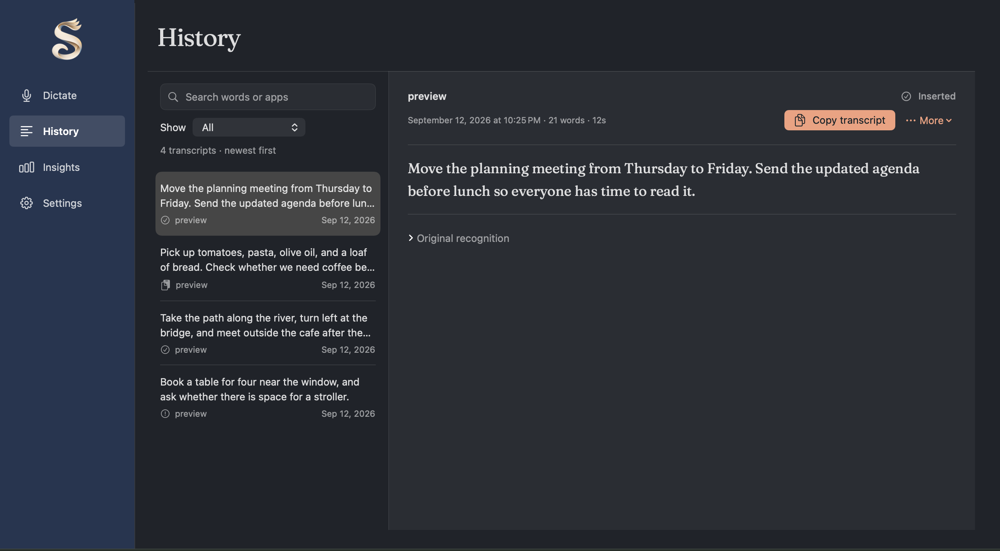

# Steno

Steno is a free, open-source dictation app for Apple silicon Macs. Hold **Option**, speak, and release to type into the app you're using. Speech recognition runs on your Mac through [whisper.cpp](https://github.com/ggerganov/whisper.cpp), with no account or API key required.

[Download](https://github.com/Ankit-Cherian/steno/releases/latest) · [Build from source](QUICKSTART.md) · [Changelog](CHANGELOG.md)

Steno requires **macOS 13 or later and Apple silicon**. Open the downloaded DMG, drag Steno into Applications, and launch it there. To update, download the latest release and replace the copy in Applications. The downloadable app includes a speech model, so you don't need to set up a separate transcription service. During setup, allow Microphone access to record, Accessibility to insert text, and Input Monitoring to use shortcuts while another app is focused.

For a first dictation, click into a text field, hold Option, and say a sentence. Release Option when you're finished. Steno transcribes the recording and inserts the result. If it reports that the text was copied instead, press **Cmd+V** where you want it. You can also recover the text from History.

For longer recordings, choose a hands-free function key in Settings → Recording; the default is **F18**. Press it once to start and again to finish. Stop finishes a recording, while Cancel discards it. You can turn on the floating live transcript to follow along as you speak. Those words may change as recognition continues; the completed recording determines the text that gets inserted and saved.

Settings also lets you adjust how Steno handles your words:

- Add recurring misheard words and preferred spellings to your word list, with optional aliases and rules for individual apps.
- Expand a short phrase into saved text, such as an address or a reply you use often. Shortcuts can apply everywhere or in one app.
- Choose cleanup preferences. Default cleanup keeps ambiguous phrases such as “like” and “you know”; Aggressive cleanup can remove its supported fillers.
- Enable media interruption to pause an app that is playing audio and resume it after recording. Steno leaves playback alone when it cannot confirm which app it would control.
- Choose a light or dark appearance, follow the system setting, and pick an accent color.

Most settings wait for **Save changes**; **Discard** restores the saved values. Appearance changes save immediately.

History keeps your most recent 1,000 dictations on your Mac. Search them, check whether the text was inserted or copied, copy it again, or delete an entry. Insights shows daily activity, streaks, words dictated, time spent, and usage by app. It stores session dates, app identifiers, and usage counts without a second copy of your transcripts or audio. Deleting a History entry leaves those usage totals intact.

Optional nearby-text continuation reads a small amount of text around the editor selection to adjust spacing and capitalization. It currently works with English text in supported fields in Apple Mail, Notes, and TextEdit. That text is temporary: it isn't saved in History or Insights or sent to the speech model. Steno skips automatic continuation in secure or unsupported fields and when it cannot confirm the original editor target.

Once the model is installed, dictation works offline. Settings → Speech model offers Medium and Large V3 Turbo downloads if you want to try another model; downloading requires an internet connection. Steno reuses the loaded model for later recordings when possible. Accuracy and response time depend on the model, your Mac, and the recording. Review the finished text, especially names and technical terms.

[View Insights](assets/1.0/insights-light.png) · [View Settings](assets/settings.png)

This guide describes the **unreleased 1.0.0 candidate**. The download link points to the latest published release, which may have different features. Screenshots use fictional sample data. The [release checklist](docs/release/1.0-checklist.md) records the remaining acceptance and distribution checks.

To build or contribute, follow the [source setup](QUICKSTART.md) and [contribution guide](CONTRIBUTING.md). Development requires Xcode with Swift 6.2 or later, XcodeGen, CMake, and the pinned local Whisper runtime and models described in the setup guide. The app uses SwiftUI and AppKit; [StenoKit](StenoKit/README.md) contains the core services and benchmark tools. The [CI guide](docs/ci-cd.md) explains the automated checks and packaging workflow.

[Support](SUPPORT.md) · [Report a security issue](SECURITY.md) · [MIT license](LICENSE) · [Third-party notices](THIRD_PARTY_NOTICES.md)
