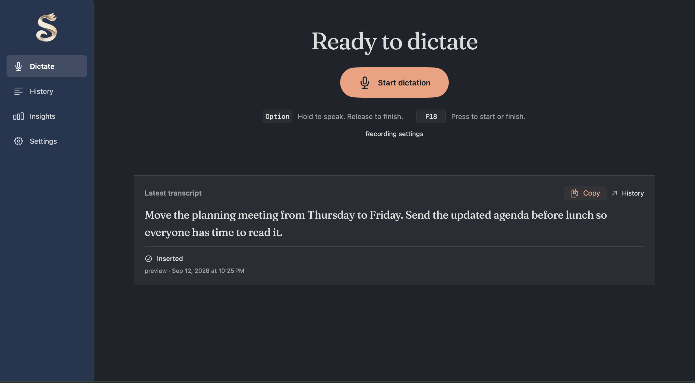
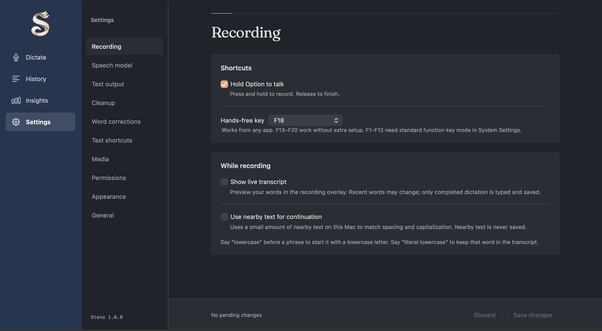

# Steno

Fast local dictation for Apple silicon Macs, with a 1.0 candidate in development.

Steno is a local-first voice-to-text app for people who want responsive dictation, reliable insertion, and conservative cleanup without shipping their audio to a hosted transcription service. The unreleased 1.0 candidate adds local Insights and a retained Whisper runtime while preserving a command-line fallback.

[](https://github.com/Ankit-Cherian/steno/actions/workflows/swift-tests.yml)

## Download

The latest public release is Steno v0.2.0:

[Download Steno-0.2.0.dmg](https://github.com/Ankit-Cherian/steno/releases/download/v0.2.0/Steno-0.2.0.dmg)

Version 1.0 is available for source review and testing only. It has not been released, signed, notarized, or published as a download.

Open the DMG, drag Steno to Applications, then launch Steno from Applications. Source setup is only needed if you want to build or contribute to the app.

## What Is New in the 1.0 Candidate

- Three native design candidates cover Dictate, History, Insights, Settings, and onboarding. They share recording controls, transcript recovery, usage storage, and preference behavior; the final design selection is pending review.
- Optional live transcription shows a bounded preview while recording. Only the completed recording supplies the final text for insertion.
- Optional nearby-text continuation adjusts insertion spacing and conservative casing using a bounded selection snapshot from the captured editor. Nearby text never enters recognition prompts, history, or analytics.
- Insights summarizes a local activity calendar, streaks, words, known dictated time, sessions, average speed, cleanup coverage, and top apps.
- Insights stores per-session usage metadata such as counts, duration quality, application identifier, cleanup counts, and insertion outcome. It does not copy transcript text or audio into the analytics ledger.
- Usage analytics persist separately from transcript history. Deleting a transcript does not delete the corresponding aggregate usage totals.
- A private retained runtime keeps the selected Whisper model loaded between compatible dictations. If that helper fails, Steno invalidates it and uses the existing `whisper-cli` path for the request.
- Media interruption is application-targeted and fail-closed: Steno only resumes the exact application and process lineage it verified that it paused. Ambiguous playback ownership does not authorize Play.
- Cleanup remains conservative by default. Ambiguous language is preserved; phrases such as `like`, `you know`, `question mark`, `open paren`, and `slash command` are not automatically inferred away or converted to symbols. Narrow filler removal is available only through the explicit aggressive policy.

## What Steno Does

- High-accuracy local transcription with `whisper.cpp`
- Bundled `small.en` for immediate first-run use, with in-app downloads for larger canonical models based on your hardware
- App-aware insertion: direct typing where it is safe, clipboard-first behavior where paste-sensitive targets need it
- Global dictation controls: `Option` hold-to-talk plus a configurable hands-free toggle key
- Local cleanup with tone, structure, conservative repair and punctuation handling, lexicon corrections, and explicit aggressive filler removal
- Personal lexicon corrections, app-specific overrides, and text shortcuts
- Searchable transcript history with transcript inspection and recovery-oriented copy actions
- A separate local Insights ledger for activity, streak, word, time, session, speed, cleanup, and top-app summaries
- VoiceOver-aware controls and reduced-motion-aware animation behavior
- Nonactivating recording overlay with a static recording indicator, readable flowing preview, outcome icons, and a cancel control

## Validation Status

The May 15 evaluation is historical evidence for the 0.2.1 candidate on one M5 Pro / 64GB / Large V3 Turbo row. It does not validate the current unreleased 1.0 tree or other hardware/model combinations.

The 1.0 preparation uses automated package tests, hosted macOS tests, an unsigned app build, generated-project/signing audits, and benchmark-report validation where applicable. Manual microphone, media-player, insertion, UI, VoiceOver, installed-app, and macOS 13 checks remain pending; signing and notarization have not been performed.

## Screenshots

These are historical 0.2 product screenshots. They are not manual UI evidence for the unreleased 1.0 candidate.

<table>
  <tr>
    <td></td>
    <td></td>
  </tr>
</table>

## Developer Setup

For source builds, use [QUICKSTART.md](QUICKSTART.md). Local development requires an Apple silicon Mac running macOS 13 or later, Xcode, XcodeGen, CMake, the pinned `whisper.cpp` checkout, a local model, and the Silero VAD model. The canonical binaries live under `vendor/whisper.cpp/build-steno/`.

### Model guidance

Steno curates four canonical local models:

- `base.en`
- `small.en`
- `medium.en`
- `large-v3-turbo`

Conservative starting points:

| Detected Apple silicon tier | Unified memory | Recommended default |
|---|---:|---|
| Base M1 / M2 / M3 | 8GB-16GB | `small.en` |
| Base M2 / M3 / M4 / M5 | 24GB-32GB | `medium.en` |
| Pro-tier chips | 16GB-31GB | `medium.en` |
| Pro / Max chips | 32GB+ | `large-v3-turbo` |

These are recommendation tiers, not blanket validation claims. Exact validated rows live in the compatibility matrix and release-eval artifacts.

## Daily Use

- Hold `Option` to record immediately, then release to transcribe and insert.
- Use the configured hands-free function key to start and stop dictation without holding a modifier.
- Let Steno route insertion by target: direct typing for standard editors, safer clipboard-oriented behavior where needed.
- Use Settings to control cleanup tone, structure, filler removal, command handling, appearance, and engine configuration.
- Use History to search old transcripts, recover prior text, and copy the output for pasting where you need it.
- Use Insights to review local usage trends without placing transcript text or audio in the analytics ledger.

## Retained Runtime

The retained runtime launches `steno-whisper-runtime` as a private child process and communicates through inherited pipes. It does not expose an HTTP server or network listener. The first retained request pays model-load cost; changing the model, VAD path, or another load identity invalidates that context and the next request reloads it. Sleep/wake recovery, memory pressure, cancellation, shutdown, or helper failure can also unload the retained context. The existing `whisper-cli` engine remains the safe fallback.

## Release Eval

The repo-level release-eval entrypoint is:

```bash
STENO_WHISPER_CLI=/absolute/path/to/whisper-cli \
STENO_WHISPER_MODEL=/absolute/path/to/ggml-large-v3-turbo.bin \
STENO_VAD_MODEL=/absolute/path/to/ggml-silero-v6.2.0.bin \
STENO_LIBRISPEECH_ROOT=/absolute/path/to/librispeech_test_clean \
scripts/run-release-eval.sh
```

Useful notes:

- `scripts/run-release-eval.sh --smoke-only` runs only the package tests plus the smoke fixture benchmark.
- Full release eval writes local audit artifacts that stay out of git.
- Smoke and release evidence are intentionally separate.
- The release report also records `not_evaluable` gates when the corpus did not honestly exercise a metric.

For the benchmark and signoff workflow details, see [docs/release/release-eval.md](docs/release/release-eval.md).

## Contributor Path

- Setup and contributor workflow: [CONTRIBUTING.md](CONTRIBUTING.md)
- Fast local run instructions: [QUICKSTART.md](QUICKSTART.md)
- Historical 0.2 release brief: [docs/release/v0.2.0-release-brief.md](docs/release/v0.2.0-release-brief.md)
- Direct-download DMG workflow: [docs/release/direct-distribution.md](docs/release/direct-distribution.md)
- Core package overview: [StenoKit/README.md](StenoKit/README.md)

## Known Limitations

- Apple silicon Mac running macOS 13 or later
- Local setup still expects the pinned `whisper.cpp` checkout, a `build-steno` runtime, and downloaded Whisper and VAD model files
- Release-eval validation is row-specific, not universal hardware proof
- Production microphone behavior is broader than the current benchmark corpus
- Recognition and cleanup can still make errors; review names, numbers, negation, and other meaning-sensitive text before sharing it
- The unreleased 1.0 candidate still requires manual live-app checks plus distribution signing and notarization before release

## Security

See [SECURITY.md](SECURITY.md) for vulnerability reporting expectations.

## Support

See [SUPPORT.md](SUPPORT.md) for usage help and bug report paths.

## Acknowledgments

Steno uses [whisper.cpp](https://github.com/ggerganov/whisper.cpp) by Georgi Gerganov and contributors for local speech-to-text transcription. whisper.cpp is licensed under the MIT License. See [THIRD_PARTY_NOTICES.md](THIRD_PARTY_NOTICES.md) for the upstream notice text included with this repository.

## License

MIT — see [LICENSE](LICENSE) for details.
