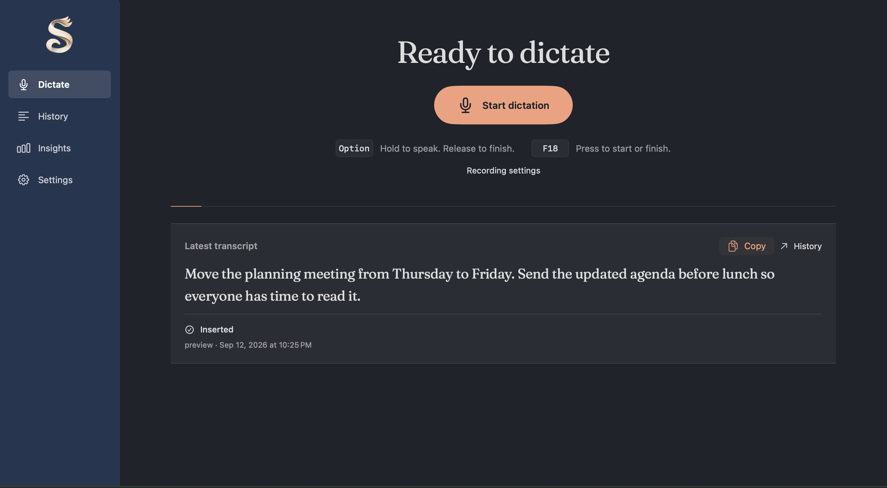
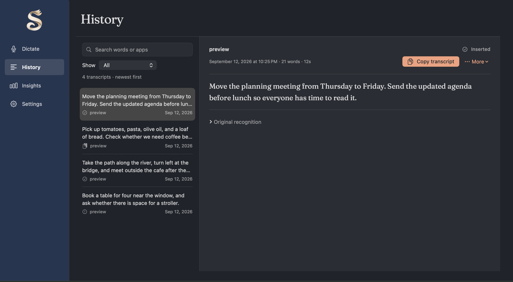

# Steno

Steno is a free, open-source dictation app for Apple silicon Macs. Hold **Option**, speak, and release to type into the app you're using. Speech recognition runs on your Mac through [whisper.cpp](https://github.com/ggerganov/whisper.cpp), with no account or API key required.

[Download](https://github.com/Ankit-Cherian/steno/releases/latest) · [Build from source](QUICKSTART.md) · [Changelog](CHANGELOG.md)

Steno requires **macOS 13 or later and Apple silicon**. Open the downloaded DMG, drag Steno into Applications, and launch it there. To update, download the latest release and replace the copy in Applications. The downloadable app includes a speech model, so you don't need to set up a separate transcription service. During setup, allow Microphone access to record, Accessibility to insert text, and Input Monitoring to use shortcuts while another app is focused. Changes you make in System Settings take effect when you switch back to Steno. While Hold Option to talk is on, Steno notices every key press and mouse click in any app so it can tell a shortcut such as Option+Arrow from a dictation. It uses only the fact that a key or button was pressed, never which one.

For a first dictation, click into a text field, hold Option, and say a sentence. Recording starts the moment Option goes down, and the overlay appears once Steno can tell you're holding Option rather than typing a shortcut. Release Option when you're finished. Steno transcribes the recording and inserts the result. It copies the text instead of inserting it when the cursor is in a password or other secure field, or when focus moved to a different field or app while it was transcribing. If it reports that the text was copied, press **Cmd+V** where you want it. You can also recover the text from History.

In Terminal and other apps where Steno pastes, it puts your previous clipboard contents back shortly after pasting, unless they were a password or other item marked private. In remote-desktop apps the transcript stays on the clipboard, because they may read it only when the remote side pastes. When Steno only copies the text, the text stays on the clipboard.

For longer recordings, choose a hands-free function key in Settings → Recording; the default is **F18**. Press it once to start and again to finish. Choose **Disabled** to turn the key off; Hold Option and the Dictate button keep working. Stop finishes a recording, while Cancel discards it, including while Steno is transcribing. Recordings stop after one hour and are transcribed, with a countdown in the overlay during the last minute. You can turn on the floating live transcript to follow along as you speak. Those words may change as recognition continues; the completed recording determines the text that gets inserted and saved.

Settings also lets you adjust how Steno handles your words:

- Add recurring misheard words and preferred spellings to your word list, with optional aliases and rules for individual apps. Corrections apply to every dictation, however clearly it was spoken, including corrections that only change capitalization, such as “github” to “GitHub”. Steno always keeps a few common words as spoken, such as “cloud” and “code”; Settings shows a correction for one of them as Never applies.
- Expand a short phrase into saved text, such as an address or a reply you use often. Shortcuts can apply everywhere or in one app.
- Choose cleanup preferences: a Natural, Paragraph or Bullets structure, and how many fillers to remove. Default cleanup keeps ambiguous phrases such as “like” and “you know”; Aggressive cleanup can remove its supported fillers.
- Enable media interruption to pause an app that is playing audio and resume it after recording. Steno pauses only apps it can confirm are playing and resumes only those, so media you paused yourself stays paused. Media interruption requires macOS 15 or later; on earlier versions the settings are unavailable.
- Choose a light or dark appearance, follow the system setting, and pick an accent color.

Most settings wait for **Save changes**; **Discard** restores the saved values. Appearance changes save immediately.

History keeps your most recent 1,000 dictations on your Mac and shows all of them. Search them, check whether the text was inserted, pasted or copied, copy it again, run cleanup again with your current settings and restore the original, delete an entry, or delete all history. Deleting also removes the text from the backup copies Steno keeps of the History file. If one of those copies is too damaged to edit, Steno says so; Delete all history removes it. Insights shows daily activity, streaks, words spoken, time spent, and usage by app. It stores session dates, app identifiers, and usage counts without a second copy of your transcripts or audio. Deleting History entries leaves those usage totals intact.

Optional nearby-text continuation reads a small amount of text around the editor selection to adjust spacing and capitalization. It currently works with English text in supported fields in Apple Mail, Notes, and TextEdit. That text is temporary: it isn't saved in History or Insights or sent to the speech model. Steno skips automatic continuation in secure or unsupported fields and when it cannot confirm the original editor target.

Once the model is installed, dictation works offline. Settings → Speech model offers Medium and Large V3 Turbo downloads if you want to try another model; downloading requires an internet connection. Each download is checked against the published file before it's installed, and downloaded models can be removed or downloaded again. Test setup transcribes a short clip to check the model and the transcription tool. Steno reuses the loaded model for later recordings when possible. Accuracy and response time depend on the model, your Mac, and the recording. Review the finished text, especially names and technical terms.

[View Insights](assets/1.0/insights-light.png) · [View Settings](assets/settings.png)

This guide describes **Steno 1.0.1**. The download link always opens the latest published release; check its version before downloading. Screenshots use fictional sample data. Build and distribution status is recorded in the [release checklist](docs/release/1.0-checklist.md).

To build or contribute, follow the [source setup](QUICKSTART.md) and [contribution guide](CONTRIBUTING.md). Development requires Xcode with Swift 6.2 or later, XcodeGen, CMake, and the pinned local Whisper runtime and models described in the setup guide. The app uses SwiftUI and AppKit; [StenoKit](StenoKit/README.md) contains the core services and benchmark tools. The [CI guide](docs/ci-cd.md) explains the automated checks and packaging workflow.

[Support](SUPPORT.md) · [Report a security issue](SECURITY.md) · [MIT license](LICENSE) · [Third-party notices](THIRD_PARTY_NOTICES.md)
